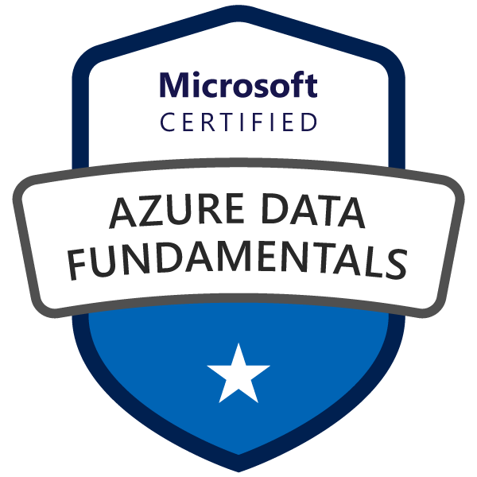

### Hi there 👋
¡Hola! Soy Adrian Vela Diaz , un apasionado de la **analítica de datos**, **IA** y las **automatizaciones** . 🚀 Transformo datos en soluciones innovadoras que optimizan procesos y generan valor estratégico. 💡 Con experiencia en proyectos en **Python**, **BI**, **bases de datos** y proyectos de **Machine Learning**, también en el diseño de **ETLs / pipelines de datos**, priorizando siempre que la construcción sea **útil, entendible y escalable**. 📊⚙️

📚 Siempre estoy explorando y aprendiendo nuevas tecnologías en **Cloud Computing, IA Aplicada,** y nuevas formas de automatizar procesos para generar impacto medible en negocio. Si te interesa colaborar o conversar sobre ideas y proyectos, ¡escríbeme! 🚀

## 🏅 Certifications

  &nbsp;&nbsp;&nbsp;&nbsp;
  &nbsp;&nbsp;&nbsp;
  

## 🌐 Socials:

## 💻 Skills:
**Languages & Tools:**

                

**Specializations:**
- 📊 Data Analysis and Visualization (Excel, Power BI, Python)
- 🤖 Machine Learning and Predictive Models (ScikitLearn, XGBoost, PySpark)
- 🛠 Data Engineering and ETL Processes (PL/SQL, SSIS, Python)
- 📈 Business Intelligence Solutions (Power BI, Power Query, DAX)
- 🔄 Automation and Process Optimization (Power Automate, Power Apps, Macros)
- 🌐 Cloud-based Data Solutions (Big Query, Azure)
- 🔍 Statistical Analysis and Data Cleaning (NumPy, Pandas, Seaborn)

## 📊 GitHub Stats:
 

---

<!-- Proudly created with GPRM ( https://gprm.itsvg.in ) -->
